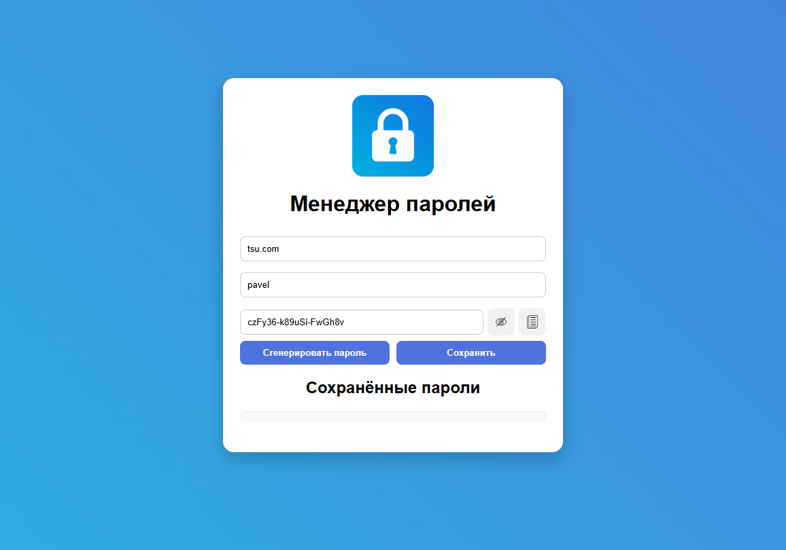
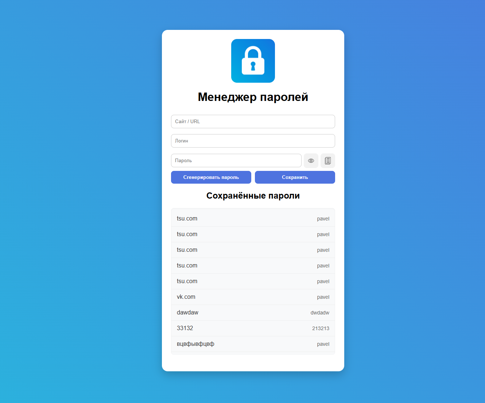
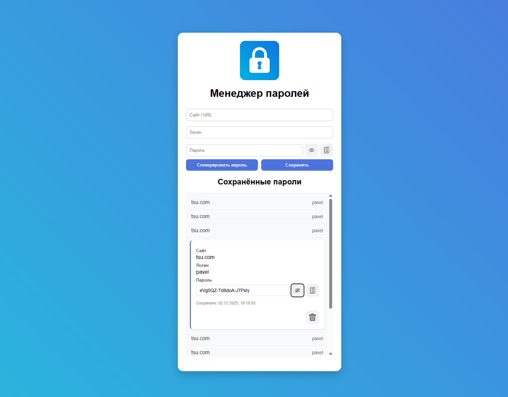

# PasswordManagerPWA

Веб-приложение менеджер паролей, реализованное как **Progressive Web App (PWA)**.  
Поддерживает генерацию, сохранение, просмотр, копирование и удаление учётных данных в браузере (локально, без backend).

---

## Описание

Приложение умеет:

- Генерировать надёжные пароли по шаблону: `XXXXXX-XXXXXX-XXXXXX` (буквы + цифры);
- Сохранять сайт, логин и пароль в IndexedDB (локальная база данных браузера);
- Отображать список записей в компактном виде "сайт — логин", с возможностью раскрытия деталей;
- Показывать/скрывать пароль;
- Копировать пароль в буфер обмена;
- Удалять записи с подтверждением;
- Работать оффлайн благодаря Service Worker;
- Устанавливаться на домашний экран как нативное приложение (на iOS и Android).

Данные никогда не покидают устройство, вся логика клиентская.

---

## Технологии

- HTML5, CSS3, JavaScript
- IndexedDB — локальное хранилище
- Service Worker — оффлайн-работа и кэширование
- Web App Manifest — установка как PWA 

## Использование

Приложение работает полностью в браузере. 
Для установки как PWA на iPhone (лично я, делал так и тестировал):

1. Разверните проект через GitHub Pages:
   - Зайдите в репозиторий на GitHub (куда выложили/клонировали этот репозиторий со всеми файлами) -> Settings -> Pages
   - В разделе Build and deployment:
     - Source: `Deploy from a branch`
     - Branch: `master` (или `main`) -> Save
   - Дождитесь сборки (1–2 мин) -> скопируйте URL вида:  
     `https://ваш-логин.github.io/репозиторий/`

2. На iPhone:
   - Откройте Safari -> перейдите по ссылке GitHub Pages;
   - Нажмите кнопку "Поделиться" внизу панели;
   - Пролистайте вниз -> выберите "На экран „Домой“";
   - При необходимости измените имя -> нажмите "Добавить".

Иконка появится на домашнем экране. Приложение запускается без адресной строки, работает оффлайн, данные хранятся локально.

## Скриншоты интерфейса приложения

## Главный экран (генерация и сохранение)

## Список паролей (компактный вид)

## Раскрытая карточка записи

## Вид мобильной версии
